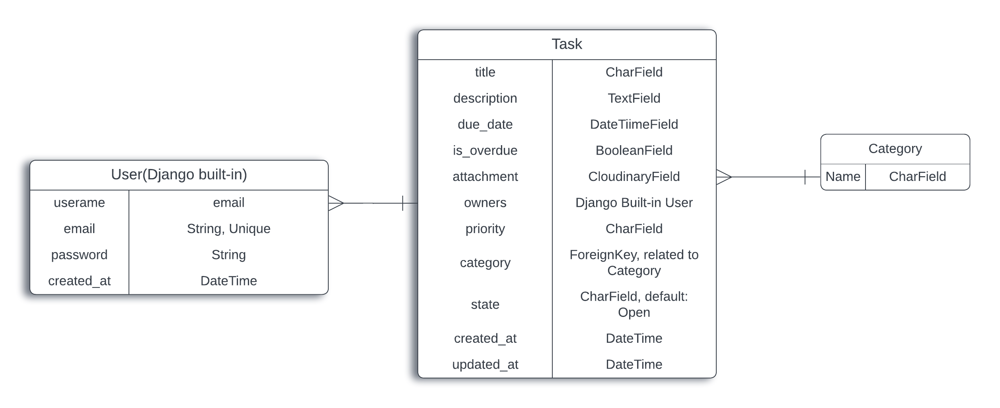

# TaskNest Backend

## Project Goals

This project provides a Django Rest Framework API for the [TaskNest React App](https://github.com/BrrunaRibeiro/tasknest-react). TaskNest is designed to help users efficiently manage tasks with filtering, prioritization, and intuitive interaction features.

The primary goals of the TaskNest backend are to:
1. Provide a robust and secure API to support task management functionality in the frontend application.
2. Implement a scalable and modular backend to accommodate future enhancements, such as collaboration features.
3. Ensure security, scalability, and maintainability through adherence to best practices in API design and defensive programming.

## Table of Contents

- [Project Goals](#project-goals)
- [Planning](#planning)
  - [Data Models](#data-models)
- [API Endpoints](#api-endpoints)
- [Frameworks, Libraries, and Dependencies](#frameworks-libraries-and-dependencies)
- [Testing](#testing)
  - [Manual Testing](#manual-testing)
  - [Automated Tests](#automated-tests)
  - [Python Validation](#python-validation)
  - [Resolved Bugs](#resolved-bugs)
  - [Unresolved Bugs](#unresolved-bugs)
- [Deployment](#deployment)
- [Credits](#credits)

---

## Planning
Planning started by creating user stories for the frontend application, based on the project goals. See the [Board for the frontend React app](https://github.com/users/BrrunaRibeiro/projects/4/views/1) for more details.

A wireframe was made for the Tasks Dashboard, which can be found in the [FrontEnd React App repository](https://github.com/BrrunaRibeiro/tasknest-react)

The user stories requiring implementation to achieve a minimum viable product (MVP) were then mapped to API endpoints required to support the desired functionality.

### Data Models

#### ERD

<p align="center">
    
</p>

#### **Task**
The `Task` model represents a task and includes:
- **Title:** A brief description of the task.
- **Description:** Detailed information about the task.
- **Priority:** The urgency level of the task (`low`, `medium`, `high`).
- **State:** The status of the task (`open`, `completed`).
- **Due Date:** When the task is expected to be completed.
- **Category:** The type of task (e.g., "Work", "Personal").
- **Owners:** A many-to-many relationship with the `User` model, allowing task sharing in future releases.

#### **Category**
The `Category` model provides categories for task classification. It includes:
- **Name:** A unique category name.

---

## API Endpoints

| **URL**             | **Notes**                                      | **HTTP Method** | **CRUD Operation** | **View Type**      | **Data Format**                                                                                   |
|----------------------|------------------------------------------------|-----------------|---------------------|--------------------|---------------------------------------------------------------------------------------------------|
| `/tasks/`           | List or filter tasks by priority, state, etc.  | GET             | Read                | List               | -                                                                                                 |
| `/tasks/<id>/`      | Retrieve, update, or delete a specific task.    | GET, PUT, PATCH, DELETE | Read, Update, Delete | Detail             | `{ "title": "string", "description": "string", "priority": "low/medium/high", "state": "open/completed" }` |
| `/create-task/`     | Create a new task.                              | POST            | Create              | Detail             | `{ "title": "string", "description": "string", "priority": "low/medium/high", "state": "open/completed" }` |
| `/categories/`      | List or create categories.                      | GET, POST       | Read, Create        | List               | `{ "name": "string" }`                                                                            |
| `/categories/<id>/` | Retrieve, update, or delete a specific category.| GET, PUT, DELETE| Read, Update, Delete| Detail             | `{ "name": "string" }`                                                                            |
| `/check-email/`     | Verify if an email is already registered.       | GET             | Read                | Utility            | -                                                                                                 |

---

## Frameworks, Libraries, and Dependencies

### Python Libraries

- **Django**: Web framework for developing the backend.
- **Django Rest Framework**: For building RESTful APIs.
- **dj-rest-auth**: Provides endpoints for authentication and registration.
- **djangorestframework-simplejwt**: Enables JSON Web Token (JWT) authentication.
- **django-filter**: Adds filtering capabilities to the API.
- **django-cors-headers**: Handles Cross-Origin Resource Sharing (CORS).
- **dj-database-url**: Parses database configuration from environment variables.
- **Cloudinary**: For managing media storage.
- **gunicorn**: Production WSGI server for Python applications.

### Frontend Integration
The backend integrates with the TaskNest React frontend via its exposed RESTful API endpoints.

---

## Testing

### Manual Testing
Manual testing was conducted for all endpoints using Postman and the Django Rest Framework's built-in interface. Key tests included:
- Verifying CRUD operations for tasks and categories.
- Ensuring email validation functionality works correctly.
- Checking authentication flows for JWT tokens.

### Automated Tests
The following test cases were implemented using Django's `APITestCase`:
- **Task Creation**
  - Successfully create a task with all required fields.
  - Validate missing fields and raise appropriate errors.
  - Prevent creation with invalid due dates.
- **Task Retrieval**
  - Allow task owners to view their tasks.
  - Prevent unauthorized access to tasks.

### Python Validation
All Python code was validated using the [PEP8CI Linter](https://pep8ci.herokuapp.com/), with no errors found.

---

## Deployment

### Prerequisites
- A GitHub repository containing your Django project.
- A Heroku account.
- Ensure you have the following files correctly set up in your project:
  - `Procfile`: Specifies the command Heroku uses to run your application.
    ```text
    web: gunicorn your_project_name.wsgi
    ```
  - `requirements.txt`: Lists all dependencies. Generate it using:
    ```bash
    pip freeze > requirements.txt
    ```
  - `runtime.txt` (Optional): Specifies the Python version, e.g.:
    ```text
    python-3.12.6
    ```

### Deployment Steps

1. **Prepare Your Application for Heroku:**
   - Ensure all static files are collected. Run:
     ```bash
     python manage.py collectstatic. I skipped this step since this is just a API.
     ```
   - Update `settings.py` to handle deployment:
     - Add:
       ```python
       ALLOWED_HOSTS
       ```
     - Set `DEBUG` to `False`:
       ```python
       DEBUG = False
       ```
     - Use environment variables for sensitive information like `SECRET_KEY` and database credentials.

2. **Push the Code to GitHub:**
   - Ensure all changes are committed and pushed to your GitHub repository.

3. **Log in to Heroku Website:**
   - Visit [Heroku](https://www.heroku.com/) and log in.

4. **Create a New Heroku App:**
   - Click **"New"** and select **"Create New App"**.
   - Provide a name for your app (must be unique) and select the region.

5. **Connect to GitHub Repository:**
   - In the **"Deploy"** tab, choose **"GitHub"** as the deployment method.
   - Connect your GitHub account if prompted.
   - Search for your repository and connect it.

6. **Configure Buildpacks:**
   - In the **"Settings"** tab, under **"Buildpacks"**, click **"Add Buildpack"**.
   - Add the following buildpacks in this order:
     1. **Python**

7. **Set Up Environment Variables:**
   - In the **"Settings"** tab, click **"Reveal Config Vars"** and add the following:
     - `SECRET_KEY`: Your Django `SECRET_KEY`.
     - `DATABASE_URL`: Your database URL (I used PostgreSQL).

8. **Deploy Your Application:**
   - Go back to the **"Deploy"** tab.
   - In the **"Manual Deploy"** section, select the branch (usually `main`) and click **"Deploy Branch"**.
   - Wait for Heroku to build and deploy your application.

## Credits

- [Django documentation](https://docs.djangoproject.com/en/stable/)
- [Django Rest Framework documentation](https://www.django-rest-framework.org/)
- [django-cors-headers documentation](https://pypi.org/project/django-cors-headers/)
- [Cloudinary documentation](https://cloudinary.com/documentation)

